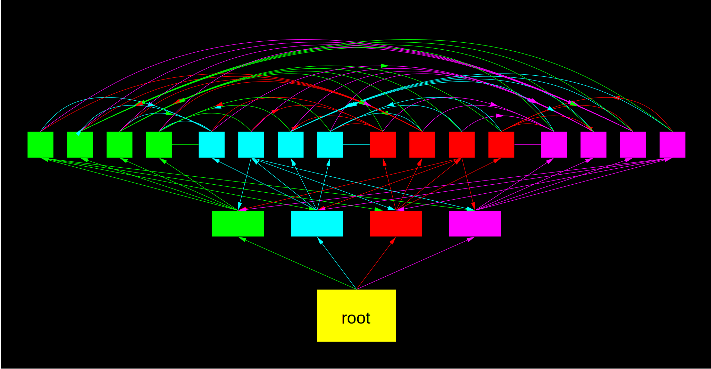

# Distributed Data #

_This is still quite incomplete_

Following the “everything is a file” philosophy of Unix, every data object is
a file.  It's uniquely referenced by its hash.  Further metadata are called
“tags”, and organized in a distributed hash table.  There are also “subjects”
(persons, computers), which are referenced by their public keys; necessary
metadata for those subjects is also found in the DHT.

As the DHT contains all the metadata, objects which are not shared public
should also not be visible in a public hash table; therefore, there are private
or group-related hash tables, as well.

## Efficient distribution of data to large numbers of peers ##

For distributing data to many peers, these peers are arranged in a colored
tree.  Data (e.g. video streems) are divided into different chunks, and sent
down different colored branches of the tree.  The leaf nodes of each colored
branch then distribute the data to the other branches.  It can be shown that
each node receives as much data as it sends (when the tree is balanced).  The
latency of the tree is O(log n); the actual base is a tradeoff of bandwidth
and sending latency.  The rule of thumb is to use the hop-to-hop latency time
to send out packets, so higher latency per hop means higher fanout of the
tree.

Trees are formed ad hoc, and since nodes can come and go as they like,
there needs to be self-healing capabilities.  Nodes know 2n neighbors for
a tree base n.  These trees are used for file-sharing, for group message
delivery, and to keep the DHT in sync.

