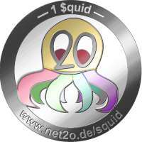
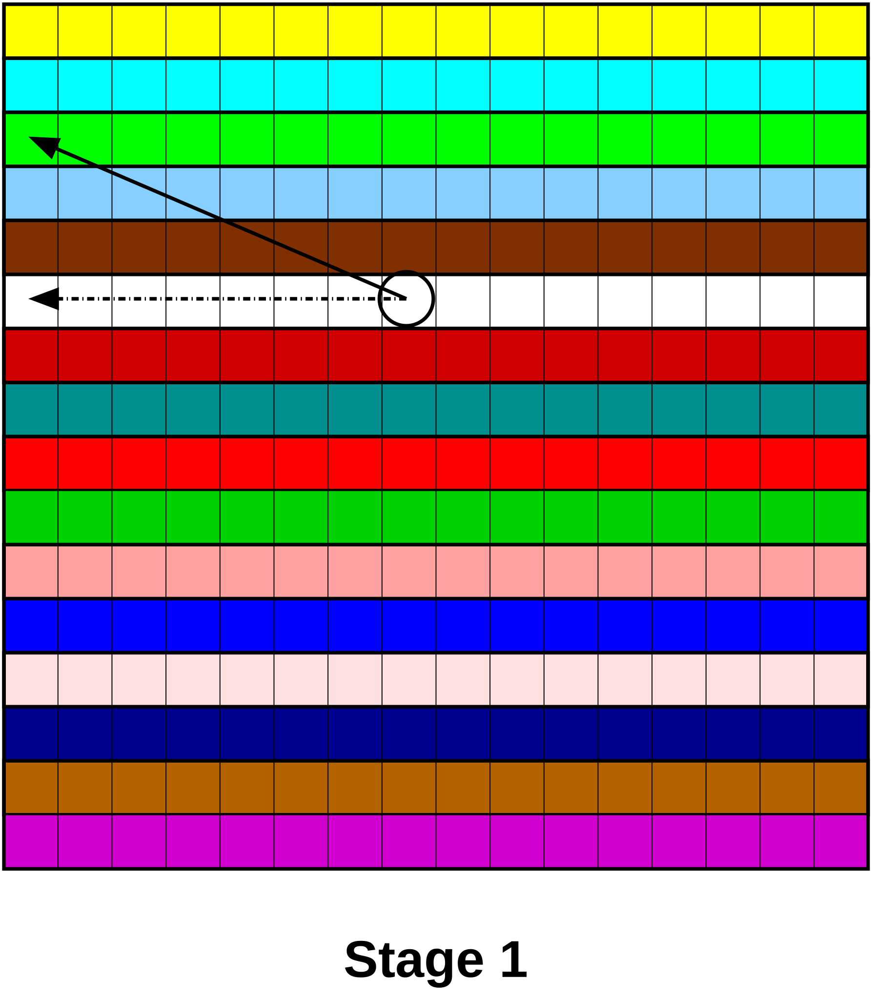
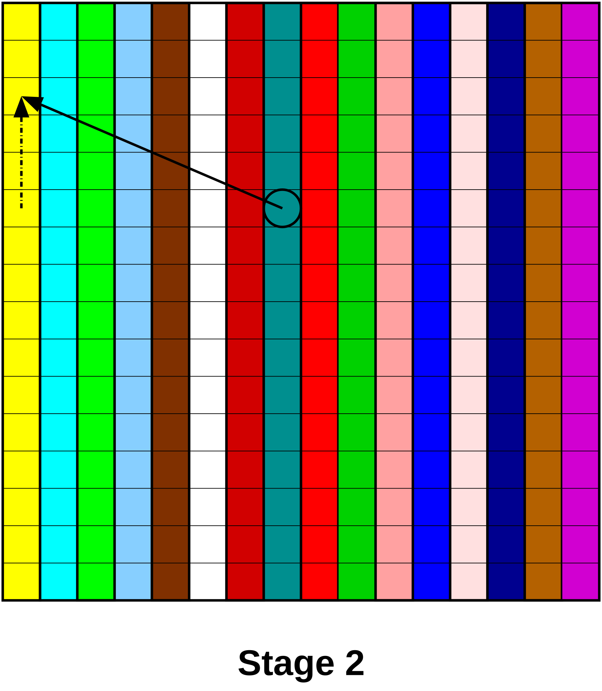

# The $quid – CryptoCurrency and BlockChain

## Abstract

10 years after BitCoins original document, the BlockChain and crypto
currencies are a big hype. Time to look at the results of the
experiment, see what failed and what works, check the consequences for
society, and propose improvements.

## Introduction

I figured out that the user layer of my net2o peer to peer protocol
needs some sort of contract/currency transaction protocol, and when
secure protocols meet money, it's not just technology that
matters. This paper therefore will therefore take both sides into
consideration.

Here's the bingo chart for all valid critics on BitCoins:

<table>
<tr>
<th>BitCoin</th>
<td>doesn't scale</td>
<td>is a snowball system</td>
<td>will be destroyed by China</td>
<td>is a plot to destoy capitalism</td>
<td>is used by drug dealers and terrorists</td>
</tr>
<tr>
<th>Bubble</th>
<td>busts next week</td>
<td>already is busted</td>
<td>inflated too much</td>
<td>deflated too much</td>
<td>is obviously a bubble</td>
</tr>
<tr>
<th></th>
<td>BitCoin is deflationary</td>
<td>The BlockChain is too big</td>
<td>Joker</td>
<td>blocks are too big</td>
<td>blocks are too small</td>
</tr>
<tr>
<th>BitCoin is</th>
<td>unregulated</td>
<td>illegal</td>
<td>only an experiment and now ended</td>
<td>worse than Fiat because not backed by material things</td>
<td>worse than my fork</td>
</tr>
<tr>
<th></th>
<td>Too many digits behind the point</td>
<td>Too few dicits behind the point</td>
<td>BitCoin is not anonymous</td>
<td>BitCoin is used for money laundering</td>
<td>Told you so!</td>
</tr>
</table>

The ideology behind BitCoins certainly is that of a libertarian
cypherpunk, with no trust in the state, but a lot of trust in anarchic
communities.  With fear of inflation, and the other disease of
currencies, deflation, as “solution”.  Pest is not a solution to
cholera, either.

## Purpose of a currency (with history lesson)

### Trade vs. speculation object

Where does the need for money come from?

### Early forms of money

Stone age society started with share economy: When you had something
in abundance, you'd share it with your larger family, the small tribe
you were associated with.  You'd expect the other members to share
their prey or whatever they had to share with you, too.  You can do
that, because there's trust and established relationship.

When society grew larger, this no longer worked.  You would trade
things, e.g. meat vs. plants or tools.  The obvious problem with that
is: you need to find someone who has a need for your thing and at the
same time provides something you have a need for.

That could be solved by exchanging tokens that everybody considered
valuable, that were easy to carry, but rare enough nobody could get
them too easily: That is the birth of money.  The first known money
mankind used (earliest at least 30000 years ago) was “shell money” or
“cowry money”, shells of maritime snails (in Chinese: 貝/贝 “bei”,
still means “money” as well as “cowry”).  They were picked up at the
shore, so you had to invest a certain amount of work to get them.

Shell money was the more valuable the further away from the shore, so
when metallurgy was invented, the people from the mountain came up
with shiny metal coins as hard to get but easy to carry and
longlasting valuables, creating silver and gold standards for
currencies.  Both shells and noble metals can serve as jewellery, so
it's not completely useless, but the main purpose for money is a proxy
for exchanged values, so you can exchange the things you have and the
things you need with different persons.  The money itself decouples
the individual acts of trade.

The work to get the shell or the coin is only invested once, but the
coin remains an interchangeable object of value, it can be traded many
times.

### Banknotes

These scarce tokens were chosen to ensure that you need a certain
amount of work to gather them, so when your time has a value, you
wouldn't waste too much on collecting shells or mining gold.  The
problem is: these things have an upper limit of availability (even if
more people collect or mine them), and when society and economy grows,
you run out of tokens.  This leads to deflation, and in deflation,
people tend to hoard their money (spending it tomorrow gets you more
than spending today), which creates an economic downcycle, and
deflation gets worse.  If it was just lack of work to get the tokens,
society would ramp up collecting shells and mining noble metals, but
if there is a natural limit to get more shells or gold, you need
another idea.

The first early forms of banknotes were financial products, the
promissory note.  Instead of actually paying, you just gave the
promise.  That allows to inflate the amount of available money to keep
business going, because now almost any valuable, even real estate,
could be converted into easy to carry paper.  Song dynasty China
e.g. had a thriving economy, and money went almost everywhere; even
the small farmers lend it to buy the land they were using from the
landlords, using state-granted credits (invented by social reformer
Wang Anshi).  But banks or private persons creating promissory notes
has trust problems.

Eventually, in the 12th century, the first state took over the role of
the trustee, and China's Song dynasty created the first legal tender
as a banknote, the 会子 (huizi, contemporary Chinese means “a while”),
which still is a promissory note, but now issued by a much larger and
more powerful entity, operating under the rule of law, and therefore
easier to trust.  And the state definitely in power to force you to
use the currency, so if you don't trust, you still have to obey.

Of course, the issue that came up in Song dynasty China quickly was
forgery, because the whole point of paper money is to make it quick
and easy to produce, and regulate the amount of money in circulation
by authoritive decisions, not by how much work was available for doing
that job.  The money got stamped with seals which were difficult to
make, but could be used for many notes, and can be kept under control.
That is a proof of ownership and authority: You can issue a note if
you prove that you own the seal.  The seal owner is not anonymous,
it's a government clerk.

The result of using such a legal tender was a boom of trade and
economy; and at the same time, the relation between the silver price
increased by a factor 100 within a few hundred years.  It should be
noted that since the end of Bretton Woods and the gold standard of the
USD in 1971, the gold price inflated by a factor of 50, and that is
not the same as the inflation rate.

The Song dynasty's huizi was somehow experimental, the following Yuan
dynasty kept the concept, and expanded it a lot.  Thanks to Marco Polo,
Europe soon got a pretty good description of how it worked, because
Marco Polo as merchant was interested in this kind of things.  One
reason why the banknote didn't catch on at that time was that neither
paper nor a sufficiently good printing press were invented here.  In
the western world, banknotes were usually exchangeable with noble
metal coins until 1970, when Bretton Woods broke.

However, most money transactions in the meantime are no longer cash,
neither coins nor banknotes, they are “fiat money”, money that's only
in the books, and only has a promise to be exchanged with banknotes,
which were promises to buy gold some time ago (but no longer are).

The act of creating “fiat money” is an act of state, the central bank
lends money to other banks, money it doesn't actually have, and when
it gets it back, it is removed from circulation.  This is something
that seems to be pretty difficult to understand, because the concept
of money used to be valuable tangible things, not numbers in an
electronic ledger.  And that it is a political decision how much money
to create or let disappear is of concern to those who don't trust
politicians — even if the lawmaker only sets rules for the conditions
to create and annihilate book money, it is unclear to many people why
these rules make sense.

And the only security these books have nowadays is that it require
physical access to the computers that hold it.  And we know how secure
computers are.  The idea of a crypto currency therefore is to provide
security of these books through mathematical magic.

## Proof of What?

It is pretty obvious that BitCoin went back all the way through human
money history, and uses the same principle shell money had to give
value to a coin: the miners do a proof of work.  Like the shells, the
amount is limited, and the difficulty raises with the amount of work
available.  The limited amount of mineable BitCoins mimics another
property of shell money, and with a quickly growing economy that
actually uses cryptocurrencies, it becomes a quickly deflating
currency.  That makes it ideal as speculation object, and very bad as
trade token.

There is a disastrous side effect to this: Mining burns energy, ASICs
are developed and manufactured, if you try to avoid ASIC mining, all
available cost-efficient GPUs are bought and gamers are frustated,
because they simply can't get hold of them.  This is far worse to
hoarding gold, because nobody actually needs gold anywhere near the
available quantities used as money.

And all that big amount of work is converted into very few actual
transactions.  BitCoin exchanges pop up that allow people to trade
with them without actually making transactions in the BitCoin
protocol; and without those transactions, that money is not secured.
Virtual bankrobbery occurs, and it shows that people who don't know
history are doomed to repeat it: Regulation is there for good reasons.

### How to cheaply secure the BlockChain

So let's take a step back, and look at what's the point of the proof
of work: The basic idea is that of securing the BlockChain against an
attack.  The BlockChain itself is immutable if you have access to the
last signed block: Through a link of hashes, every other block before
can't be changed without changing the last block, too.  The problem
is: how do you know it's _the_ valid last block?

BitCoin's concept is that you need to invest a certain amount of work
to sign a block, so the older a block is, the more work it takes to
forge it.  That concept originates from a crypto-anarchic design: in
the BitCoin world, everybody is pseudonymous, so even the signature
for the blocks are done by anonymous cowards.  We are back before the
first promissory notes, who at least had identifyable individuals as
signers.

We have to go a step back, to see where that attack comes from in the
threat model: it's a man in the middle (MITM) attack to prevent the
proper spread-out of the current block.  A MITM attack to a P2P
network.  Preventing MITM attacks has other attempts to solve them,
either, even trust on first use (TOFU) does a descent job.

Any sane secure peer to peer network ought to have something better
than nothing, TOFU or PKIs that improve trust.  And that a full-blown
PKI takes away the anonymity is not a problem: A big warehouse of
ASICs to mine BitCoins also completely blows the anonymity of the
miner.  The miner or signer doesn't need anonymity; the parties that
actually exchange coins are the ones who want anonymity.

So you can just make sure you have enough sanctions and auditable
signers of these blocks to make sure you need a simpler form of
byzantine set consensus than proof of work.

## Money and wealth

How money shapes a society, and why the limited supply of BitCoins is
far worse than neoliberalism

### Speculation object

Or is BitCoin's course a bubble?

Many humans like to gamble, and the pattern of gambling with
speculation objects are remarkable similar.  Even smart persons like
Isaac Newton lost a fortune in crashes.  The madness of humans however
can be calculated, though certainly not to the finest details.  The
BitCoin chart however looks like a classic.

Speculation bubbles don't mean the money disappears.  The money is
still there, it's just owned by someone else now.  Despite that the
total amount of money is constant through a speculation bubble, they
have a deep impact on economy.

That's because those who entered the bubble early got the money, and
those who entered late lost.  The tragedy is that the early ones are
smart and rare, and the late ones are stupid and many.  And that means
a huge concentration in money, and especially a loss for those who
didn't really have that money.

But let's assume BitCoin is not a bubble going bust, but it's supposed
to last (all 21 millions), and used as currency for everything by
everybody.  That means the price per coin would soar until the total
market cap equals the cash wealth of the entire planet.  And that
would mean all those people who were there in the early phase would be
incredible rich, just by being early.

Trickle down however doesn't work.  Money inherently trickles up.  In
a deflationary system, there is no decay of money; instead the money
of the wealthy becomes more and more just on its own.  They don't even
have to invest it to gain wealth.  The result will be an increasingly
absurd distribution of wealth, and all the assorted problems: economic
power leads to political power, corruption, tax cuts for the rich,
slavery-like work relationships, because only the rich can afford
hiring people; the poor can't.

That's not what I think as future I want.  Fiat money has its
downsides, too; but mostly when the state that controls it is in deep
troubles, and fails to create or establish rules that work for the
greater good.

### Why a BlockChain?

So when I'm bought into fiat money, and use the BlockChain only for
trading with valueables created outside, like fiat money or real
estate, then why not use a system like GNU TALER, which hands over the
job of checking the double spending to the banks?

Well, seems to be a good idea, but it turned out that the banks have
deep troubles with trust, either.

So actually, the banks see the BlockChain as the saviour of their
inability to mutual trust.

### The $quid: Useful Investment

People who defend BitCoins against the “it's a bubble” argument told
me they think of this (and of ICOs of other crypto currency projects)
as investment into a technology.  I doubt that Satoshi Nakamoto will
actually sell his coins, so it doesn't quite work, but I'm fine with
the idea of investment.

I therefore propose a useful speculation object for humans who like
the proof of work concept to back a currency (not to back the security
of the transactions!) that is in the collection of cowry shells and
the mining of gold, or in good rules for fiat money, which are also
backed by big, real economies, and the real work that happens there.
The common idea between these two concepts is that they are valuable,
because it is hard work to obtain them.  And once you have them, you
can exchange them for other goods that are equally hard work, and they
retain their value.

But first, I want to explain the name: $quid a combination of the $
symbol (pronounced simply “S” here), and the word quid.  Quid is a
word for a metal-backed currency, the pound sterling (240 pennies of
silver of sterling quality are a imperial pound).  But it also is the
first word in “quid pro quo”, a very important concept in society, and
the foundation why trade actually works.  It's about cooperative
behavior even when the persons participating are egoists, forced by
game theory to be cooperative.

One thing we have in society that lacks a bit quid pro quo is free
software development.  You give, people take, most of them without
giving back.  Developers participating in free software development
take and give back, and that's why we do it: We all stand on the
shoulders of others.  Even if you scroll through the licenses of a
proprietary OS like iOS, you see an amazing amount of free software
that has been used there.

So how do you mine $quids?  You create useful free software, and then
you get the right to issue $quids.  It's up to organizations like the
Linux Foundation or the GNU project to figure out who qualifies and if
the amount of work that allegedly went into the project is plausible,
this supervision will avoid fraud.  Of course, like BitCoin, the $quid
is an experiment, and the number of $quids that can go onto that
market depend on the acceptance.

The difference between normal sponsorship and this approach is that
while the issuers of $quids get paid for their work, the people who
pay can trade the $quid, like investors in corporations can sell
stocks.  And while the effort of a corporation to develop proprieatary
software is ultimately lost to humanity, and the pay-back for the
investors is through profits, the effort of free software developers
is not lost; it can be shared and it can be used to improve and base
upon; so paying them and still having the $quid as currency to trade
is a fair deal: Society as a whole got richer through the creation of
free software, so increasing the amount of money in circulation is ok.

It's like when you buy a house: you have to pay the builders.  If it
was a short-lasting product of consumption, that's it, your money is
spent, no tradeable value returned.  But a house is long-lasting, and
becomes a tradeable object of value itself.  That works, because it is
a rivalrous good, you can not easily copy it, they are expensive to
build, you need real estate in the right place for them.  So in
effect, the value of a house depends on how much people can afford,
and in a growing economy, the price of houses rise.  So depending on
the price development, you can make a profit even including the costs
of maintenance, heating and so on.

Free software is a non-rivalrous good.  You can copy it as much as you
like, you can change it and fit it to your purpose (supposed it is
constructed lean enough, and you have the qualification for doing
that), so it's not directly tradeable.

So therefore I propose to turn free software development effort, which
is a scarce resource, into a tradeable currency, and thereby make this
work valuable.

Ah, yes, and penguins eat squids, too.

## How to really distribute book-keeping

An important design goal for me is to handle massive ammounts of
micropayments, because that's an application where I see a legitime
need for a crypto currency.  Ransomware fees, tax evasion, and illegal
business are probably already handled well by BitCoin.

All coins have a value, a unit (if you want to keep different kinds of
values in the same ledger, you need that), a creation date (time of
the creating transaction, which also is the index into the
corresponding block), and an owner pubkey.

All transactions contain a block hash that refers to the state of the
ledger at the beginning of this transaction, a list of origins, and
the credited amount, a list of destinations and the debited amount, a
contract, a list of signatures of all originators (showing the consent
of those) and finally a list of signatures of all destinations.  All
sources must be from the same ledger, all destinations must be direct
peers of that ledger.

These are the operations you want to perform in the ledger:

  1. You want to move a coin from one ledger to another (implies key
  change, so it is a transaction between different pseudonymous
  owners)

  2. You want to be able to join several coins into one, i.e you allow
  several transactions to have the same destination, and all of these
  are merged together into one coin there.  One of the sources can
  have the same owner as the destination, just an earlier transaction
  date.

  3. You want to split a coin.  As long as the balance is ok, you can
  take from a coin and leave a smaller coin under the same id, it's
  just a double output transaction, and the transaction itself is
  valid.  You can't do that transaction again, because the transaction
  has the original value and the resulting value embedded, it won't
  match against the smaller coin.  It can't be replayed if you later
  merge the coin up to the same value, as it also has a transaction
  date, and that would be earlier than the created coin.

Coins are pseudonymous, and you can have many different pseudonyms.
However, coins have readable values attached.  It's likely that mix
services will be offered for gaining anonymity.  You transfer to one
coin of the mix service, and you get back several coins from other
coins of that same mix service, and you split and merge them
accordingly when you want to do your next transaction.

There is no need for a nonce, the key as id of the owner is
sufficient.  The check of the balance is sufficient to prevent any
abuse.

### Double entry bookkeeping system

First of all, if you are somehow familiar with bookkeeping, “a ledger”
has something fundamentally wrong in it: The singular.  You are
supposed to have more than one ledger, and every transaction needs to
go to two ledgers, one as debit, one as credit (the two columns of the
ledgers).

If you want to scale a crypto currency, you want to separate ledgers
by some arbitrary criteria so that the individual nodes are not
overloaded, and millions of bookings can get in per second; which is a
fairly reasonable number for micropayment.

Since you want to check if a coin someone offers you has already been
spent, you want to ask the corresponding ledger for it.  The ledger
records incoming and outgoing (credit and debit) in two log files, and
keeps the active coins available for query.  So you want to select the
ledger based on the pubkey of the coin — a short part of it (or its
hash) to a reasonable size.  DDoS attacks at particular ledgers can be
easily mittigated: if the ledger you want to book to is attacked, you
just select a new pubkey; if the ledger you want to book from is
attacked, you may need to use another coin in your wallet, and hope
the attacked ledger is getting unstuck.

The ledger units responsible for the same ledger each verify that they
have a consensus over the transactions; by syncing their positions.
And then we combine the ledgers and check the balance: It ought to be
zero.

That will make the transaction protocol a bit tricky, because you have
to make sure that both ledgers really enter your transaction in the
same time slot.  The easy way to do that is to do a staged entry:
First, you queue the credit entries (the „take out“), then you send
them to the debit ledger, and if that succeeds, you can commit both.

To enter a coin from outside into a double booking system, you need
two transactions: One is the coin itself (debit), and the other is a
promise to buy it back (credit).

The Purpose of that conservation of all transactions is to make it
easy to cross-check the ledgers for consistency.  If you have n
ledgers, you summ all the columns in them (which can be done in
parallel), and you cross-check by summing all the n results: The
balance ought to be zero.

### Subdividing further

So the first stage scaling is that of individual ledgers for parts of
the coin space, and cross-checking the balance of all of them in one
go.  I don't know when that starts to become an issue, but you have to
think about it to scale further.  You might want to have too many
ledgers to sum them up all in one go.

The single balance makes it easy: You can take coins from any ledger
to any other in one single step (all ledgers are peers of each other).

But that may be too many connections from one ledger server to all the
others.  So here's a way to scale:

We break the ledgers into groups, which are supposed to balance within
one transaction.  This is a 2D example, but it works in any number of
dimensions.  We have two maps of the leger groups, and the
transactions alternate between one and the other group.  That means we
can do either transactions within one local group, or within a global
group that has one element of each local group as possible
destination.  We have 16 groups here, and each ledger needs 30 open
connections, instead of 255 if all were connected to every other
ledger.  So we get to _2\*sqrt(n)-2_ instead of _n-1._  More dimensions
mean higher roots, so with m dimensions, it is _m\*(n)^(1/m)-m._

In each stage, the ledgers of the same color are connected.  The
balance is calculated only for the group of connected ledgers; the
signatures for the verified balance goes into the next block.  By
interleaving the two modes of connectivity, after only two cycles (or
_m in the general case), all previous records from all ledgers are
chained together.

In order to allow routing destinations, ledgers take responsibility of
out-group destinations for one cycle: If the current mode is local,
the ledger is responsible that can move the transaction to the correct
foreign group in the next cycle.  If the current mode is global, the
ledger is responsible that can move the transaction to the correct
local ledger in the next cycle.  So after two further cycles, the
transaction has reached its destination.  All the transactions satisfy
the balance rules, the better scalability only comes at the cost of
more cycles to complete a transaction.  But better scalability means
that the cycle time can be shorter.

### Share and enjoy!

## Literature

  1. [Stages in a bubble](https://people.hofstra.edu/geotrans/eng/ch7en/conc7en/stages_in_a_bubble.html)
  2. [Historic Stock Market Crashes, Bubbles & Financial Crises](http://www.thebubblebubble.com/historic-crashes/)
  3. [Extraordinary Popular Delusions and the Madness of Crowds (1841)](https://en.wikipedia.org/wiki/Extraordinary_Popular_Delusions_and_the_Madness_of_Crowds)
  4. [Online resource for double entry bookkeeping](http://www.double-entry-bookkeeping.com/double-entry-bookkeeping-tutorial/)
  5. [Distributed atomic transactions](https://www.cockroachlabs.com/blog/how-cockroachdb-distributes-atomic-transactions/)