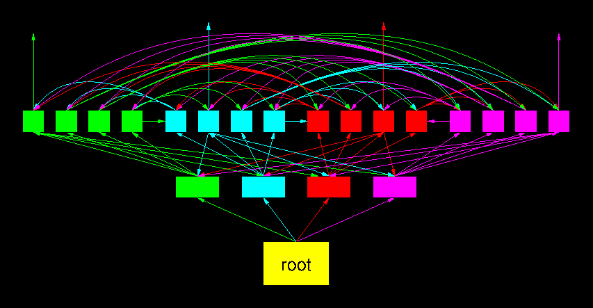

# Video Conferencing #

## Feature Requests ##

* Stream from camera, cropped vertically (portrait)
* Stream from desktop/window
* Scaled down stream for all participants
* Scaled up stream for talking participants
* Two talking participants side-by-side with upscaled stream
* Audio mixer&autolevel
* Hotkey to turn audio and video on/off
* Display FFT of audio for visualisation
* Audio biquad filters, e.g. notch, to improve bad sound quality
* Push to talk, hotkeys for everything
* Hotkey for cut mark + keyframe
* Local recording with higher res/audio quality for presenter
* Allow multiple devices (cameras, mics) for one participant (Akira Kurosawa
  setup), no own audio in backchannel
  - Bonus points if multiple participants in the same room can be identified
    (e.g. send a short chirp out, and check for it in other audio streams)
* Templates for nice presentation recording
* Set a logo for the talk
* Have a countdown clock for talk slots
* Share slides directly (slides in Markdown)
* Subtitles as option for slides (possibly multiple languages)
* Translated audio tracks to select from (for bigger conferences)
* Rooms for small-group side conversation
* Moderator side channel to presenter/participants
* Try connections to different participants and take best one
* Mix additional audio sources (background music, desktop sounds,
  claps/laughers)
* Spatial audio (different participants from different directions)

## Wish list ##

These are “nice to have” features with some caveats.

* Recognize eyes and move them upwards so that it looks like the participant
  is looking at you (instead of downwards)

## Architecture ##

While the network itself is peer to peer, the roles in a video conference have
a central point, the moderator.  The moderator collects the streams that are
created at the endpoints, mixes them, and distributes the result to
everybody.

This is easy when the central instance is a well connected server.  With a p2p
network, you have to distribute the load of both collecting the data and
distributing it, but the central point of control (the moderator) remains.

### Life streaming ###

net2o's basic paradigm is that of storage objects, so every object (file) has
a hash, and sending participants can authenticate objects with a signature.
Life streaming however means new information is added on the fly.

Participants send metadata information on every update: (size, hash) for every
object, and a signature for all objects.

A complete video stream consists of several objects:

* Audio index (one index block per second, one data size per packet)
* Audio data (Opus encoded data)
* Video index (one index block per second, one data size per packet)
* Video data (h.264/h.265/vp8/vp9/av1 depending on what's available for the
  hardware encoder)
* Metadata index (timestamp:type:size)
* Metadata (thumbnails as small images, subtitles as text, shared slides as
  files)

Video data encoding depends on what's available as hardware encoder with the
participants.

Tradeoffs: Software video encoders have good quality, but are slow.  Hardware
encoders have lower quality, but are fast and don’t consume much power.

Life streaming requires real–time distribution of data from one to many
participants.  net2o uses an avalanche tree distribution for streaming:  Data
stream blocks are partitioned.  Each partition is send to a tree of nodes.
The branch nodes send it forward to further nodes.  The leaf nodes send it
forward to nodes from other partitions.  This makes sure that every node has
the same load.

### Collection tree and mixing ###

Each active node in a video conference creates a stream of data.  Mixing the
data is distributed; sending it directly to one central instance will easily
overwealm that one.

* Leaf nodes send their stream upwards. Audio is processed by applying filter,
  volume control and spatial audio at the leaf, video streams are truncated
  and scaled down as necessary.
* Participants can offer their own stream as life stream for others to join,
  but other nodes will only select one or two life streams
* Branch nodes combine leaf node streams and own stream to mixed stream
  * Audio is just mixed together
  * Video is stiched together (if possible without transcoding, see for
    example this paper [using HEVC for stitching videos
    together](http://iphome.hhi.de/schierl/assets/2014_Cloud-video-Mixing-HEVC.pdf))
  * Rogue participants ignoring commands are muted either here or if the
    entire branch is rogue, at the root
* Root node combines final downmix, and distribute that as life stream
* Every participant has one single upstream
* Branch nodes have multiple downstreams (asymmetric subscriber lines work
  well here)
* Every participant handles a fair share of the central stream distribution
* Every participant needs to encode one stream + local copies of the own
  recording
* Every participant needs to decode more than one stream
* The instructions how to downscale and mix the incoming streams come from the
  moderator node

The own recording is available afterwards for remixing the entire conference
with higher quality, or in case connection losses took out participants and
people want to check what they missed.
